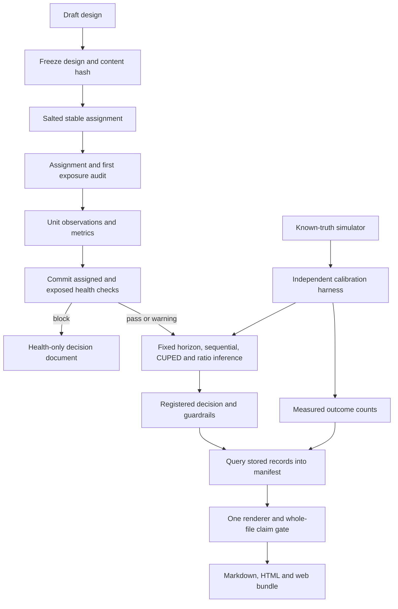

# Architecture

The calibration box is separate because `packages/calibrate` generates samples from parameters the engine never receives and counts conclusions from the public statistical interfaces. It does not validate the engine by substituting the engine's standard errors into its own truth test. CUPED is additionally checked by variation of estimates across repeated experiments, independent of the engine's reported reduction. Monte Carlo intervals describe uncertainty of those empirical checks.

The registry uses SQLModel over SQLAlchemy. Each operation has a transaction boundary and commits before returning. Async FastAPI endpoints dispatch synchronous database and numerical work to a thread pool. SQLite supports a portable demo and relational evidence snapshot; Postgres is exercised independently and is the intended deployment database. Alembic supplies the schema migration.

The registered design is an immutable JSON snapshot with a content hash. Subsequent design edits append deviations and do not silently change the frozen design used in analysis. The public experiment's design was reconstructed after the original experiment, a distinction carried into every readout. The demo token controls writes; it does not offer multi-tenant ownership or fine-grained authorization.

Health commits in its own transaction before the engine receives a persisted copy. A failed calculation can leave a pending run with health evidence, which is preferable to an unrecorded failed attempt. Runs and decisions are queried by both experiment and resource identity. The separate-connection test and separate-process HTTP check observe commit durability independently of the request's session.

Canonical results live in the database. The compressed relational snapshot preserves the records used for the published bundle and documents. The publication gate restores that snapshot into a temporary database, queries it, renders complete files and compares them. Regeneration runs the scenarios and calibration afresh; verification does not reinterpret an old evidence timestamp as a new measurement.

The Next.js static export consumes the same bundle shape from the live API or committed files. Registry and readout views respect health status. Uploads require a live token-gated API; read-only use works from the static bundle. HTML output escapes uploaded text before Markdown conversion. A fresh canonical reset follows any demo recording and precedes final publication.

For production, revisit background jobs, immutable object storage, database-level role isolation, optimistic concurrency, explicit sequential stopping policies and resource quotas. Those are operational extensions, not statistical validation claims.
