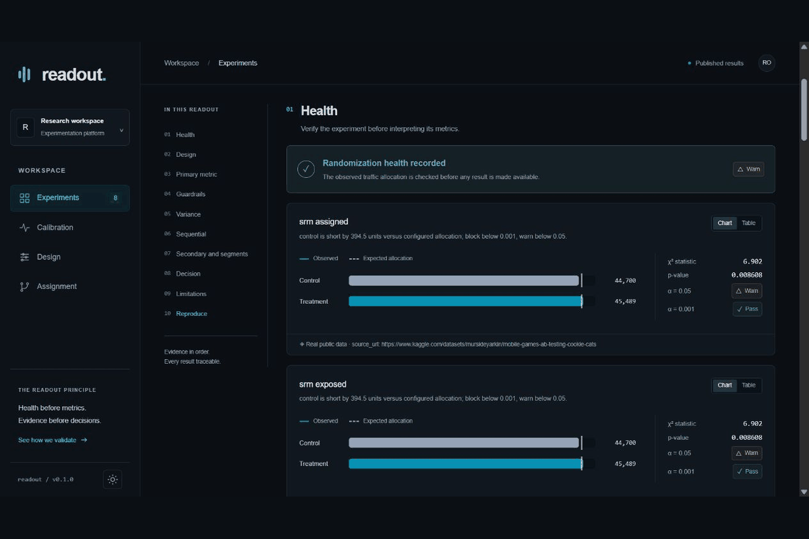

# readout

Health first. Evidence before decisions.

An experimentation registry, deterministic assignment service and statistical review desk. Designs are frozen before this platform accepts observations. Health checks commit before metrics run. The final product is a downloadable decision document rendered directly from stored evidence.



## What the tool measured

Under daily peeking at simulated null experiments, naive inference rejected in **26.30% [23.67%, 29.12%]** and the normal-mixture sequential method in **0.80% [0.41%, 1.57%]**. These are Monte Carlo intervals, not production outcomes. The estimated-variance sequential method is an asymptotic approximation, not a universal finite-sample guarantee.

The full [results](RESULTS.md), [calibration evidence](web/public/results/bundle.json) and [Cookie Cats readout](readouts/cookie_cats.md) expose the assumptions and uncertainty. Every published readout and this document are rendered by the same [whole-file claim gate](packages/render/src/readout_render/renderer.py). Editing a generated claim makes the gate fail.

## Explore

- [Experiment registry](https://mekala27-45.github.io/readout/experiments/)
- [Calibration](https://mekala27-45.github.io/readout/calibration/)
- [Design calculator](https://mekala27-45.github.io/readout/design/)
- [Assignment laboratory](https://mekala27-45.github.io/readout/assign/)

The static client reads the committed evidence bundle when the configured API is unavailable. Write operations and CSV uploads require a running API and its demo write token. Deployment verification is recorded in [the runbook](docs/runbook.md); a configured URL is not itself evidence of a successful deployment.

## Reproduce locally

```sh
uv sync --frozen
uv run python -m scripts.restore_evidence
uv run python -m scripts.check_published_numbers
uv run uvicorn readout_api.app:app --host 127.0.0.1 --port 8000
```

In another terminal:

```sh
cd web
npm ci
npm run dev
```

Set `NEXT_PUBLIC_API_BASE_URL` and the write token according to `.env.example` for uploads. The read-only evidence experience needs no account or key. To regenerate measured evidence, run `uv run python -m scripts.reset_and_rederive`. To render one decision, run `uv run readout render cookie_cats`.

## Engineering evidence

- Frozen registered designs, explicit protocol deviations and experiment-scoped read paths.
- Independently committed health rows, refused empty analyses and blocked readouts with no metric section.
- Assignment stability under treatment ramps, cross-process determinism and measured allocation uniformity.
- Separate-connection and separate-process persistence checks, including Postgres.
- Independent simulation harness: it knows the generating truth and counts the engine's outcomes.
- CUPED, cluster-aware ratio inference, guardrail non-inferiority and corrected exploratory comparisons.
- [Pricepoint reproduction](experiments/pricepoint/assumptions.json) using the original measured residual scale and log price contrast.

## Boundaries

This is a demonstration platform with token-gated writes, not a multi-tenant production service. Public data designs are retrospective reconstructions. Cookie Cats has no pre-period covariates or timestamps; its source records assignment rather than actual gate exposure. CUPED and a temporal sequential chart are therefore unavailable for that readout. The statistical methods and simulation limits are documented in [methods](docs/methods.md).

Bayesian analysis, bandits, uplift models, non-randomized causal designs, novelty modeling and mutually exclusive layers are deferred. The source dataset's license is described in [provenance](experiments/cookie_cats/PROVENANCE.md); the repository's software uses [Apache License](LICENSE).
